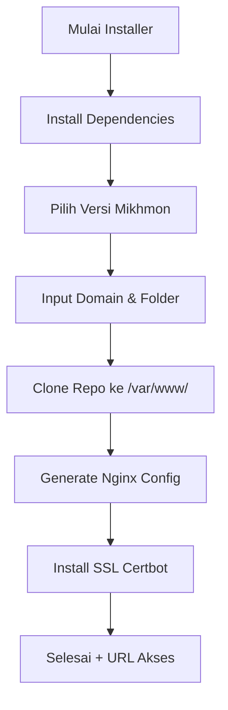

# 🎉 **Mikhmon Multi Installer — PREMIUM Edition**

<p align="center">
  
  
  
  
</p>

---

<p align="center">
  
</p>

> 🚀 **Installer PREMIUM untuk Mikhmon Multi Domain + HTTPS**
> Mendukung instalasi banyak Mikhmon dalam satu VPS + auto Nginx + auto SSL.
# ✨ **Fitur PREMIUM**

* ✔ Install banyak Mikhmon dalam 1 VPS
* ✔ Input domain manual
* ✔ Auto konfigurasi NGINX per domain
* ✔ Auto install PHP, MariaDB, dependensi lengkap
* ✔ Auto SSL (Cloudflare / Certbot)
* ✔ Auto folder isolasi per domain
* ✔ Auto update permission & struktur
* ✔ Tersedia versi “Sangat Ringan” untuk NAT VPS
* ✔ Log proses instalasi rapi
* ✔ Tanpa error *unbound variable*

---

## 🔥 Fitur Utama

* Install **Mikhmon-Agent**
* Install **Mikhmon PPPoE ROS 6**
* Install **Mikhmon PPPoE ROS 7**
* Install **Mikhmon + GenieACS Integration**
* Konfigurasi HTTPS otomatis (Certbot)
* Konfigurasi Virtual Host Nginx otomatis
* Multi-instances (banyak domain atau subdomain)
* Premium error handler
* Warna tampilan premium

---

## ⚙️ Arsitektur Installer

Installer ini menggunakan struktur modular agar mudah dikembangkan:

### **1. Core Function**

| Fungsi              | Deskripsi                                                         |
| ------------------- | ----------------------------------------------------------------- |
| `install_base()`    | Install semua dependencies dasar (nginx, php, certbot, git, curl) |
| `choose_version()`  | User memilih versi Mikhmon yang akan di-install                   |
| `setup_nginx()`     | Generate file konfigurasi Nginx otomatis                          |
| `setup_https()`     | Generate dan setup SSL otomatis via Certbot                       |
| `install_mikhmon()` | Clone repo + konfigurasi folder + permission                      |

---

### **2. Flow Installer**



---

## 📥 Cara Install (Rekomendasi)

### **1. WGET**

```bash
wget -O installer-mikhmon.sh https://raw.githubusercontent.com/heruhendri/Installer-Mikhmon-VPS/master/installer-mikhmon.sh
chmod +x installer-mikhmon.sh
./installer-mikhmon.sh
```

### **2. CURL**

```bash
curl -o installer-mikhmon.sh https://raw.githubusercontent.com/heruhendri/Installer-Mikhmon-VPS/master/installer-mikhmon.sh
chmod +x installer-mikhmon.sh
./installer-mikhmon.sh
```

### **3. One-line Auto Install**

```bash
bash <(curl -s https://raw.githubusercontent.com/heruhendri/Installer-Mikhmon-VPS/master/installer-mikhmon.sh)
```

---

## 📂 Struktur Folder

Setelah instalasi, file akan ditempatkan di:

```
/var/www/<nama-folder-instance>/
```

---
# 🛠 **Perintah Tambahan**

### 🔄 Remove instalasi

```bash
rm -rf /var/www/mikhmon-namadomain
rm /etc/nginx/sites-enabled/namadomain
systemctl restart nginx
```

---
## 📘 Panduan Penggunaan

Setiap versi memiliki dokumentasi lengkap:

| Versi            | Dokumentasi                                                                                                                        |
| ---------------- | ---------------------------------------------------------------------------------------------------------------------------------- |
| Mikhmon-Agent    | [https://github.com/heruhendri/mikhmon-agent#readme](https://github.com/heruhendri/mikhmon-agent#readme)                           |
| PPPoE ROS 6      | [https://github.com/heruhendri/Mikhmon-PPPoE-Ros.6#readme](https://github.com/heruhendri/Mikhmon-PPPoE-Ros.6#readme)               |
| PPPoE ROS 7      | [https://github.com/heruhendri/Mikhmon-PPPoE-Ros.7#readme](https://github.com/heruhendri/Mikhmon-PPPoE-Ros.7#readme)               |
| Mikhmon GenieACS | [https://github.com/heruhendri/Mikhmon-GenieAcs-WAgateway#readme](https://github.com/heruhendri/Mikhmon-GenieAcs-WAgateway#readme) |

---

## 🛠 Requirements

* OS: Ubuntu 18 / 20 / 22 / 24 LTS
* Akses root
* Domain / subdomain aktif
* DNS A record → mengarah ke IP VPS
* Port 80 dan 443 harus bisa diakses publik

---

## 💎 Premium Error Handler

Semua error akan ditangkap otomatis dan ditampilkan dengan tampilan premium.

---
# 🧑‍💻  **Hendri — Network Engineer / NOC**

Jika butuh bantuan atau custom installer:
* 📩 **Email**: [heruu2004@gmail.com](mailto:heruu2004@gmail.com)
* 🔥 **Telegram**: [https://t.me/GbtTapiPngnSndiri](https://t.me/GbtTapiPngnSndiri)

---

## ❤️ Donasi & Support
Jika script ini membantu, bantu bintang ⭐ di GitHub 🙂
[https://github.com/heruhendri/Installer-Mikhmon-VPS](https://github.com/heruhendri/Installer-Mikhmon-VPS)

---


## 📜 Lisensi

MIT License 
