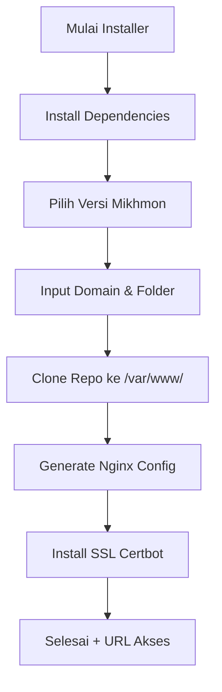

Berikut **README.md final** yang sudah lengkap, rapi, profesional, dan siap dipasang di GitHub repo Anda **Installer-Mikhmon-VPS**.

---

# 🚀 MIKHMON MULTI INSTALLER — PREMIUM EDITION

### **Automated Installer for Multi Mikhmon + HTTPS + Nginx**

**By Hendri — 2025**

---

## 📌 Tentang Project

Repository ini berisi **installer otomatis** untuk deploy berbagai versi **Mikhmon** secara cepat, aman, dan terstruktur pada VPS / NATVPS / Dedicated Server.

Installer ini juga mendukung:

✔ Multi-instances (bisa install banyak Mikhmon dalam 1 server)
✔ HTTPS otomatis via Certbot (Let’s Encrypt)
✔ Auto konfigurasi Nginx
✔ Auto clone repository versi yang kamu pilih
✔ Auto permission webserver
✔ Premium Logs + Error Handler

---

## 🔥 Fitur Utama

* Install **Mikhmon-Agent**
* Install **Mikhmon PPPoE ROS 6**
* Install **Mikhmon PPPoE ROS 7**
* Install **Mikhmon + GenieACS Integration**
* Konfigurasi HTTPS otomatis (Certbot)
* Konfigurasi Virtual Host Nginx otomatis
* Multi-instances (banyak domain atau subdomain)
* Premium error handler
* Warna tampilan premium

---

## ⚙️ Arsitektur Installer

Installer ini menggunakan struktur modular agar mudah dikembangkan:

### **1. Core Function**

| Fungsi              | Deskripsi                                                         |
| ------------------- | ----------------------------------------------------------------- |
| `install_base()`    | Install semua dependencies dasar (nginx, php, certbot, git, curl) |
| `choose_version()`  | User memilih versi Mikhmon yang akan di-install                   |
| `setup_nginx()`     | Generate file konfigurasi Nginx otomatis                          |
| `setup_https()`     | Generate dan setup SSL otomatis via Certbot                       |
| `install_mikhmon()` | Clone repo + konfigurasi folder + permission                      |

---

### **2. Flow Installer**



---

## 📥 Cara Install (Rekomendasi)

### **1. WGET**

```bash
wget -O installer-mikhmon https://raw.githubusercontent.com/heruhendri/Installer-Mikhmon-VPS/master/installer-mikhmon
chmod +x installer-mikhmon
./installer-mikhmon
```

### **2. CURL**

```bash
curl -o installer-mikhmon https://raw.githubusercontent.com/heruhendri/Installer-Mikhmon-VPS/master/installer-mikhmon
chmod +x installer-mikhmon
./installer-mikhmon
```

### **3. One-line Auto Install**

```bash
bash <(curl -s https://raw.githubusercontent.com/heruhendri/Installer-Mikhmon-VPS/master/installer-mikhmon)
```

---

## 📂 Struktur Folder

Setelah instalasi, file akan ditempatkan di:

```
/var/www/<nama-folder-instance>/
```

---

## 📘 Panduan Penggunaan

Setiap versi memiliki dokumentasi lengkap:

| Versi            | Dokumentasi                                                                                                                        |
| ---------------- | ---------------------------------------------------------------------------------------------------------------------------------- |
| Mikhmon-Agent    | [https://github.com/heruhendri/mikhmon-agent#readme](https://github.com/heruhendri/mikhmon-agent#readme)                           |
| PPPoE ROS 6      | [https://github.com/heruhendri/Mikhmon-PPPoE-Ros.6#readme](https://github.com/heruhendri/Mikhmon-PPPoE-Ros.6#readme)               |
| PPPoE ROS 7      | [https://github.com/heruhendri/Mikhmon-PPPoE-Ros.7#readme](https://github.com/heruhendri/Mikhmon-PPPoE-Ros.7#readme)               |
| Mikhmon GenieACS | [https://github.com/heruhendri/Mikhmon-GenieAcs-WAgateway#readme](https://github.com/heruhendri/Mikhmon-GenieAcs-WAgateway#readme) |

---

## 🛠 Requirements

* OS: Ubuntu 18 / 20 / 22 / 24 LTS
* Akses root
* Domain / subdomain aktif
* DNS A record → mengarah ke IP VPS
* Port 80 dan 443 harus bisa diakses publik

---

## 💎 Premium Error Handler

Semua error akan ditangkap otomatis dan ditampilkan dengan tampilan premium.

---

## 🪪 Support

Jika butuh bantuan atau custom installer:

📩 **Email**: [heruu2004@gmail.com](mailto:heruu2004@gmail.com)
🔥 **Telegram**: [https://t.me/GbtTapiPngnSndiri](https://t.me/GbtTapiPngnSndiri)

---

## ❤️ Donasi & Support

Jika installer ini membantu, dukung saya dengan ⭐ di GitHub.

---

## 📜 Lisensi

MIT License – Bebas dipakai & dikembangkan.

---

Jika Anda ingin menambahkan badge, logo, atau banner README premium, saya bisa buatkan.
